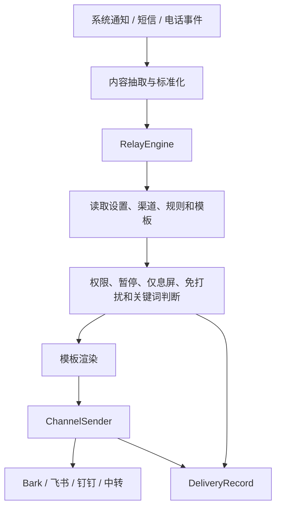

# 架构说明

消息接力当前保持单 Android App 模块：`:app`。代码按能力拆在 `io.github.messagerelay` 包内，避免发布前做高风险多模块重构。

## 用户界面

- `MainActivity.kt`：Jetpack Compose 入口，承载首页、记录、设置和二级页面。
- `ReleaseNotes.kt`：应用内更新日志数据。
- `TimeFormatter.kt`：用户可见时间格式化。
- `RelayWidget.kt`、`res/layout/relay_widget.xml`：桌面小组件。

## 设置与持久化

- `AppSettingsRepository.kt`：DataStore 设置读写，包括主题、首次配置、主渠道、免打扰、记录保留、更新检查等。
- `Database.kt`：Room 数据库、规则、模板、记录、SIM 别名和迁移。
- `SecureStore.kt`：本机加密存储渠道、Webhook、Token 等敏感配置。
- `ConfigBackup.kt`、`BackupCodec.kt`：配置备份、恢复和加密备份格式。

## 通知和消息入口

- `RelayNotificationService.kt`：通知监听入口。
- `NotificationContentExtractor.kt`：通用通知内容抽取。
- `WeChatNotificationParser.kt`：微信通知标题、会话和正文解析。
- `SmsRelay.kt`、`SmsDuplicateGuard.kt`：短信接收和重复过滤。
- `CallRelay.kt`、`RelayCallScreeningService.kt`：电话事件、SIM 信息和来电相关处理。

## 规则、模板和发送

- `RelayEngine.kt`：核心转发流程，负责设置检查、规则匹配、免打扰、模板渲染、入队和记录。
- `CoreLogic.kt`：模板、规则、免打扰、渠道校验等纯逻辑。
- `TemplateCatalog.kt`：内置模板和推荐模板。
- `ScreenStateProvider.kt`：仅息屏时推送的屏幕状态判断。
- `PerAppRouting.kt`：App 与 Bark 绑定路由选择。
- `ChannelSender.kt`：Bark、飞书、钉钉和中转发送。
- `ChannelResultParser.kt`：渠道返回结果解析。

## 版本更新

- `UpdateRepository.kt`：GitHub Releases 检查逻辑，使用公开 REST API，不内置 GitHub Token，不自动下载安装 APK。

## 数据流

## 开源边界

- 源码仓库不提交 APK、AAB、keystore、数据库、备份、日志和私有截图。
- Debug APK 用于本地验收；公开分发请使用 GitHub Releases 上传签名 APK。
- Bark Token、飞书/钉钉 Webhook、签名密钥、完整号码、验证码和完整通知正文都必须脱敏。
